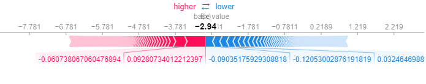

# Citation Screening and Explainable AI (XAI)

---

## Part 1: Introduction

### 1. Background on Citation Screening

Citation screening is a process commonly used in systematic reviews, where researchers look through large numbers of scientific articles (for example, from PubMed) to identify which ones are relevant to their specific research questions. In many cases, this can be very time-consuming, as each article must be reviewed to see if it meets the criteria for inclusion in a study.

Recently, machine learning models have been introduced to make this process more efficient. These models are trained to predict whether a given article is relevant or not, potentially saving a lot of manual screening time. However, traditional machine learning and deep learning models often function like "black boxes," providing predictions (e.g., _relevant_ or _not relevant_ ) without giving clear reasons why they made those predictions.

### 2. Motivation for Explainable AI (XAI)

In the context of citation screening, a model's decision can have significant implications—if it excludes relevant articles by mistake, important information might be missed, and if it includes too many irrelevant articles, researchers still waste time. Consequently, trust in the model's decisions is very important.

This is where **Explainable AI (XAI)** comes in. XAI methods help make the model's reasoning more transparent. Instead of just producing a yes/no answer, they can show _why_ the model labels some articles as relevant or not. This added transparency helps build trust among users (often researchers or clinicians) because it allows them to see the most influential words or factors that led the model to its conclusion.

### 3. Objective of This Work

The main goal here is to explore and apply XAI methods to the citation screening models used in the CRUISE project. The project wants to see if techniques such as SHAP (SHapley Additive exPlanations) and LIME (Local Interpretable Model-agnostic Explanations) can improve users' trust and understanding. In other words, the focus is on explaining _why_ an article is deemed relevant or irrelevant, rather than just assigning a label.

We will take a balanced subset of the PubMed data (focusing on the top three largest queries to make the problem more manageable) and train different models to classify articles as relevant or not. Then, we will apply SHAP and LIME to these models and evaluate how well these explanations help us interpret the decisions.

---

## Part 2: XAI Overview

### 1. What is XAI?

Explainable AI (XAI) refers to techniques that provide insights into how AI or machine learning models make predictions. Instead of treating the model as a black box, XAI opens it up (at least in part) so that humans can see _why_ certain inputs lead to certain outputs.

**Why it matters:** In medical or research settings, trust is crucial. If we cannot understand a model's reasoning, it becomes difficult to rely on it—especially in tasks like citation screening where missing an important study could change the conclusions of a systematic review.

### 2. Basic Methods: SHAP and LIME

Two popular methods for explaining model decisions are **SHAP** and **LIME** .

#### SHAP (SHapley Additive exPlanations)

- **Key idea:** It's based on Shapley values from game theory. Think of each feature (such as a word in the abstract) as a "player" in a cooperative game that contributes to the final decision.
- **What it does:** SHAP calculates how much each feature (word, phrase, etc.) changes the prediction from what would happen if that feature were absent. These contributions can be positive or negative, indicating whether the feature pushes the prediction toward "relevant" or "irrelevant."

#### LIME (Local Interpretable Model-agnostic Explanations)

- **Key idea:** LIME explains individual predictions by approximating the complex model locally with a simpler, more interpretable model (like a small linear model around one data point).
- **What it does:** It looks at one article at a time, slightly perturbs the text, and sees how the main model's predictions change. It then figures out which words are most responsible for pushing the model's decision in one direction or the other.

Both SHAP and LIME are model-agnostic, meaning they work with many types of models—ranging from logistic regression and random forests to deep learning Transformers. In practice, we can run these methods after training our classification models and visually inspect which features most contribute to predictions of relevance or irrelevance.

I'll format the document using Markdown to improve readability while maintaining the original content structure.

---

## Part 3: Classification Problem Description

### Dataset Origin and Structure

Our dataset comes from a file called `pubmed_data.csv`, which contains PubMed articles labeled with:

- `query_id`: identifies which systematic review query the article belongs to
- `title` and `abstract`: core text describing the article
- `relevance`: indicates if an article is relevant (1) or irrelevant (0) for a particular query

### Focusing on the Top 3 Queries

To make the classification task more manageable, we selected the three query_ids with the most records:

1. CD009263
2. CD010409
3. CD010213

These top queries still provide substantial data for training and testing.

### Balancing the Classes

A common issue in citation screening datasets is class imbalance, with far more irrelevant articles than relevant ones. To address this, we used downsampling:

- Keep all relevant samples (1's)
- Randomly sample an equal number of irrelevant samples (0's)
- Combine these subsets into a new, balanced dataset

This approach helps prevent bias toward predicting "irrelevant" most of the time. After balancing, each selected query has an equal count of relevant and irrelevant samples.

### Classification Goal

The final objective is to build a model that, given an article's text (title and abstract) and a particular query, predicts whether the article is relevant (1) or irrelevant (0). We'll then apply XAI methods to understand which words or features most influence the decision.

---

## Part 4: Preprocessing and Modeling Workflow

### Data Preprocessing

#### Combining Title and Abstract

We concatenate title and abstract into a single text field:

```python
text = title + " - " + abstract
```

This simplifies feeding the text into TF-IDF vectorizers or transformer-based models.

#### TF-IDF Vectorization (Classical Machine Learning)

Convert text into numeric features using TF-IDF:

```python
from sklearn.feature_extraction.text import TfidfVectorizer

vectorizer = TfidfVectorizer(max_features=200)
X_tfidf = vectorizer.fit_transform(balanced_data['text'])
```

Each article is now represented by a vector of TF-IDF scores indicating word importance relative to the dataset.

#### Transformer-Based Approach

We also test a Hugging Face Transformers pipeline (e.g., bert-base-uncased) to evaluate deep learning model performance. In this scenario, we provide text directly to the pipeline without manually creating TF-IDF features.

### Train/Test Split

To fairly evaluate models, we split the balanced dataset:

```python
from sklearn.model_selection import train_test_split

X_train, X_test, y_train, y_test = train_test_split(
    X_tfidf,  # or text features for classical ML
    balanced_data['relevance'],
    test_size=0.5,  # 50-50 split
    random_state=42
)
```

This ensures performance metrics are calculated on unseen data.

### Classification Models

We experiment with multiple models to compare performance and explainability:

1. **Logistic Regression**

   - Relatively simple yet strong baseline
   - Outputs probability of relevance based on linear combinations of TF-IDF features

2. **Random Forest**

   - Ensemble model using multiple decision trees
   - Captures more complex relationships than logistic regression

3. **Transformer Pipeline**

   - Uses pretrained language models (like BERT or Deepseek-R1)
   - Grasps contextual meaning in text
   - Input format: `"query: <query_id> article: <title + abstract>"`

### XAI Libraries

After fitting models, we use SHAP and LIME to generate explanations:

#### SHAP (SHapley Additive exPlanations)

```python
import shap
explainer = shap.Explainer(model)
shap_values = explainer(X_test_sample)

# Visualization options
shap.plots.text(shap_values)  # Presenting created text and its SHAP values
shap.plots.bar(shap_values)   # for tabular features
```

#### LIME (Local Interpretable Model-agnostic Explanations)

```python
from lime.lime_text import LimeTextExplainer
lime_explainer = LimeTextExplainer(class_names=['Non-Relevant','Relevant']) #creating LIME Explainer instance
exp = lime_explainer.explain_instance(
    text_instance,
    predict_proba_function,
    num_features=10
)
exp.show_in_notebook()
```

LIME helps visualize which words in a single article drive the prediction toward Relevant or Non-Relevant.

By following these steps—cleaning and merging text data, balancing classes, splitting into train/test sets, and applying different machine learning approaches—we establish a solid foundation for explainability methods.

Beside all written steps & methods provided above (that can be found in the file *XAI_on_pubmed_data.ipynb*, additional tests were made on the LogisticRegression model, presented as part of the project of another project group - **Data Imbalance Team**. Based on their model's results, in the notebook *DW_main.ipynb* there are added additional lines, for XAI - LIME & SHAP. Main goal of this approach was to test how it behaves on scikit-learn models, that are achieving better results than LR & DT presented in the *XAI_on_pubmed_data.ipynb* files.

---

## Part 5: Final Results

### XAI on Deepseek model

<p align="center">
  
</p>  

<p align="center"><strong>Fig.1</strong> Force plot for a data sample classified as <strong>Relevant</strong>.</p>  

A **force plot** in the SHAP framework visually represents how individual feature contributions push a model's prediction toward a specific class.  

In this case, the resulting value is **0.93**, which represents the total **SHAP value score**. This indicates that the combined influence of all features supports the **label 1 (Relevant)**. However, the relatively small confidence level suggests some degree of uncertainty in the classification.

<p align="center">
  
</p>  

<p align="center"><strong>Fig.2</strong> Interactive text visualization of SHAP for two examples (<strong>Class 1 and Class 0</strong>, respectively).</p>  

This visualization displays the full input text in an interactive format. It allows the user to toggle between **SHAP contributions for Class 0 or Class 1**, highlighting which words influenced the model’s prediction toward each class. After pointing the mouse on one of the words, its contribution to the prediction is shown on the plot above the paragraph.

<p align="center">
  
</p>  

<p align="center"><strong>Fig.3</strong> SHAP mean bar plot showing the most influential words in the model's predictions.</p>  

This visualization ranks the **top features contributing to the model's decision**, based on their mean absolute SHAP values. Words with **higher values** have a stronger influence on the output. The **sum of 269 other features** accounts for a large portion of the overall impact, while individual words like *"vasive"*, *"results"*, and *"pancreatic"* also significantly contribute to the prediction.

---

### XAI on Logistic Regression model

<p align="center">
  
</p>  

<p align="center"><strong>Fig. 4</strong> LIME Explanation for Logistic Regression without Class Imbalance Handling</p>  

This visualization illustrates how the **model is heavily biased towards the "Non-Relevant" class**, predicting it with near **100% confidence**. The presence of **imbalanced data** likely caused the model to overfit to this majority class. Additionally, the features shown contribute to the prediction, but due to the **Tf-Idf tokenizer's nature**, some extracted words may appear **less interpretable**.

<p align="center">
  
</p>  

<p align="center"><strong>Fig. 5</strong> SHAP Force Plot for Logistic Regression without Class Imbalance Handling</p>  

This **SHAP Force Plot** confirms the previous observations. The model assigns a **total SHAP value of -4.24**, indicating a **strong confidence in predicting label 0 (Non-Relevant)**. This further supports the notion that the model is heavily biased towards the majority class.

<p align="center">
  
</p>  

<p align="center"><strong>Fig. 6</strong> SHAP Force Plot for Logistic Regression on Data with Downsampling Algorithm</p>  

This **SHAP Force Plot** shows a **total SHAP value of -2.94**, indicating that the model is becoming **less certain in predicting label 0 (Non-Relevant)**. While it still leans towards this prediction, the lower absolute value suggests a more balanced decision-making process compared to the previous version without class imbalance handling.

<p align="center">
  
</p>  

<p align="center"><strong>Fig. 7</strong> LIME on Logistic Regression with Upsampling and Downsampling</p>  

This **LIME visualization** shows that the model is now predicting the **Non-Relevant** label with **less certainty (81%)** compared to earlier cases. The contribution of individual features remains evident, with some influencing the **Relevant** class as well. The balancing techniques applied to the data have resulted in a more **uncertain classification**, making the model's predictions more flexible.

---
## Part 6: Conclusions

Explainable AI (XAI) plays a crucial role in overcoming the limitations of **black-box models**, allowing us to understand how predictions are made. By using **SHAP and LIME**, we can visualize the contribution of individual features, which is particularly valuable in **text-based tasks** where model decisions may not always be intuitive.  

Python libraries **SHAP** and **LIME** provide clear and interpretable visualizations, helping researchers and practitioners **gain deeper insights** into their models. While **XAI methods** are relatively easy to implement, they require **significant expertise** in Python libraries to correctly initialize and use the appropriate **Explainer instances**, ensuring accurate and meaningful explanations.


